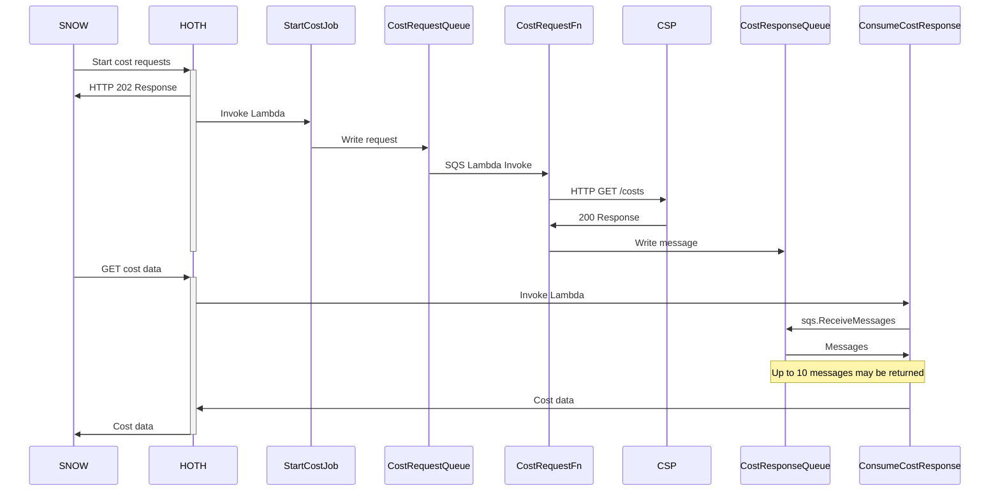

# Handling requests

The process for handling requests is somewhat complex and built to require
maintaining as little state as possible, preferring to store messages in an
SQS Queue over a long-term storage mechanism like a DynamoDB table.

## Data Transformations

The ATAT CSP API and the HOTH API do not use the same representations of data.
This requires transformations between the data types during the requests.

## Cost Request process

This diagram covers the process for how the API is invoked for a Cost Request.

